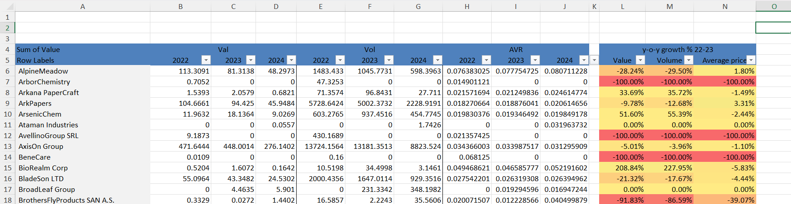
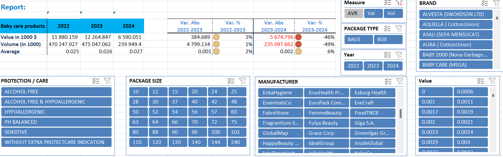

# Baby Care Product Analysis in Excel

## Project Overview
This project focuses on analyzing the performance of the baby care market using real-world FMCG (Fast-Moving Consumer Goods) data. The goal is to provide actionable insights to stakeholders through a structured and interactive Excel report that leverages pivot tables, slicers, and data preprocessing.

## Objectives
- **Data Preprocessing**: Clean the dataset by addressing missing values and organizing it to allow meaningful analysis.
- **Report Table Creation**: Build a primary report table summarizing key metrics like volume, value, and average price across manufacturers and other breakdowns.
- **Interactive Dashboard**: Integrate pivot table slicers to enable filtering by package type, size, and product attributes.
- **Market Insights**: Evaluate the overall market performance and provide an in-depth interpretation of trends and metrics.

## Problem Statement
Organizations in the baby care segment need a comprehensive view of their performance across different levels, such as brand, package type, and product attributes. However, raw data often includes gaps, redundancies, or lacks structure, which hinders decision-making. This project addresses these challenges by transforming raw data into a structured, interactive report for business leaders.

## Project Workflow
- **Data Cleaning**:
  - Removed blank rows without volume or value data for 2022, 2023, and 2024.
  - Standardized dataset structure to facilitate report creation.

- **Primary Report Table**:
  - Created a table summarizing key metrics (Value, Volume, and Average Price) for all manufacturers.
  - Included Year-To-Date (YTD) data for 2024.

       
     *Figure: Organized Table*

- **Pivot Table and Slicers**:
  - Built pivot tables as the backbone for the report.
  - Added slicers to filter data by package type, package size, and product attributes.
  
       
     *Figure: Report with Slicers*

- **Interpretation**:
  - Analyzed trends in sold volumes, revenues, and pricing strategies to identify market dynamics and manufacturer performance.

## Key Findings
Between 2022-2023, the baby care market achieved a small increase overall, increasing the value of the products by 3% and achieving a volume increase of 1%. Such moderate growth rates are not surprising, as the baby care market is definitely in its mature stage. Moreover, the number of babies born in the region where the data was collected is very stable. In such an environment, companies compete to gain market share at the expense of other brands.

Between 2023-2024, the analysis doesn’t make much sense since we are comparing the values of a whole year (2023) with only some days (2024).

### Product Attributes Development:
1. Alcohol-Free products grew much faster than the rest of the pack (+20% in terms of sales and volume; average price stayed the same).
2. PH Balanced products saw a -1.7% decrease in revenue despite a 5.2% price increase.
3. Sensitive products grew by +13% despite an 11% price decrease.
4. Products without extra ProtectCare indication saw a -6% decline after a 2% price increase.

It is interesting to note that at the product attributes level, price increases led to lower sales. Product categories that kept their prices stable or reduced them experienced higher sales. Therefore, one can conclude that a significant number of clients in this industry are very sensitive to price increases. There is an important price elasticity factor that needs to be considered by top-level management in every firm.

## Conclusion
This project highlights the importance of structured data analysis for understanding market dynamics. By transforming raw FMCG data into actionable insights, decision-makers are empowered to monitor trends, evaluate performance, and make informed business strategies. Additionally, understanding price sensitivity and product attribute performance is crucial for maintaining competitiveness in a mature market.

## Tools and Technologies
- **Excel**: Used for data cleaning, pivot table creation, and slicer integration.
- **Python**: Assisted with melting operation of the dataset.